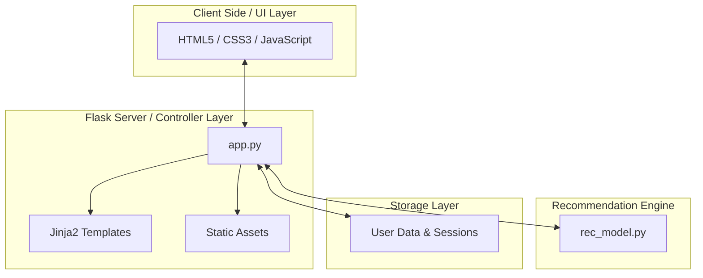
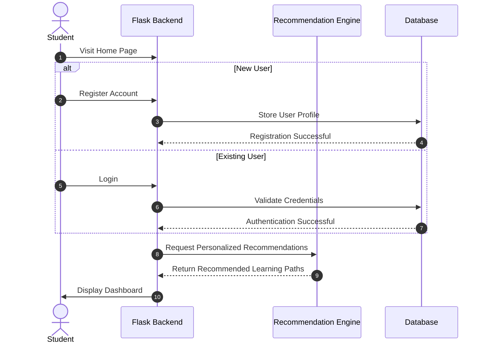

# 🚀 Learnifly - Gamified EdTech Platform

Learnifly is an interactive **Gamified EdTech Platform** designed to transform traditional learning into an engaging and rewarding experience. Built using **Flask**, the platform combines personalized learning recommendations with gamification features such as XP tracking, achievement badges, learning streaks, and progress dashboards.

The goal of Learnifly is to improve student engagement by adapting content based on user performance while maintaining motivation through rewards and visual progress tracking.

---

# 🏗️ System Architecture

Learnifly follows a modular **Model-View-Controller (MVC)** architecture.

* **Frontend (View Layer):** HTML5, CSS3, JavaScript, Jinja2 Templates
* **Backend (Controller Layer):** Flask Application
* **Recommendation Engine (Model Layer):** Personalized Content Recommendation System
* **Database/Session Layer:** User Authentication & Progress Tracking



---

# 🔄 User Workflow

The following diagram illustrates the complete student journey from registration to receiving personalized learning recommendations.



---

# 📂 Project Structure

```text
learnifly/
│
├── __pycache__/
│
├── static/
│   ├── images/
│   ├── profile.css
│   ├── script.js
│   └── style.css
│
├── templates/
│   ├── home.html
│   ├── login.html
│   ├── profile.html
│   └── signup.html
│
├── app.py
├── rec_model.py
├── requirements.txt
└── README.md
```

---

# ✨ Features

## 🎯 Personalized Learning

* Intelligent content recommendations
* Adaptive learning paths
* Performance-based content suggestions

## 🎮 Gamification System

* XP (Experience Points)
* Achievement Badges
* Learning Levels
* Daily Learning Streaks

## 📊 Progress Tracking

* Interactive Dashboard
* Learning Statistics
* Progress Visualization
* Performance Analytics

## 🔐 Secure Authentication

* User Registration
* User Login
* Session Management
* Profile Tracking

---

# 🛠️ Technology Stack

| Category              | Technologies                       |
| --------------------- | ---------------------------------- |
| Backend               | Flask, Python                      |
| Frontend              | HTML5, CSS3, JavaScript            |
| Templates             | Jinja2                             |
| Recommendation System | Python-based Recommendation Engine |
| Authentication        | Flask Sessions                     |
| Deployment            | Render / Railway / VPS             |

---

# 🎮 Gamification Mechanics

### Smart Recommendations

The recommendation engine analyzes user activity and learning history to suggest relevant content.

### XP & Level System

Users earn experience points by completing learning modules and activities.

### Achievement Badges

Students unlock badges upon reaching predefined milestones.

### Daily Streaks

Consistent learning behavior is rewarded through streak tracking and retention mechanisms.

---

# ⚙️ Installation

## Prerequisites

* Python 3.12+
* pip

## Clone Repository

```bash
git clone https://github.com/yourusername/learnifly.git

cd learnifly
```

## Create Virtual Environment

### Windows

```bash
python -m venv venv

venv\Scripts\activate
```

### Linux/macOS

```bash
python3 -m venv venv

source venv/bin/activate
```

## Install Dependencies

```bash
pip install -r requirements.txt
```

## Run Application

```bash
python app.py
```

---

# 🌐 Access Application

Open your browser and visit:

```text
http://127.0.0.1:5000
```

---

# 🚀 Future Enhancements

* AI-Powered Learning Assistant
* Real-Time Leaderboards
* Course Marketplace
* Certificate Generation
* Mobile Application
* Social Learning Features
* Advanced Analytics Dashboard

---

# 🤝 Contributing

Contributions are welcome!

1. Fork the repository
2. Create a feature branch
3. Commit your changes
4. Push the branch
5. Open a Pull Request

---

# 📜 License

This project is licensed under the MIT License.

---

# 👨‍💻 Author

**Ajinkya Ghuge**

B.Tech Computer Science Engineer | Developer | AI & ML Enthusiast

⭐ If you found this project useful, don't forget to star the repository!
